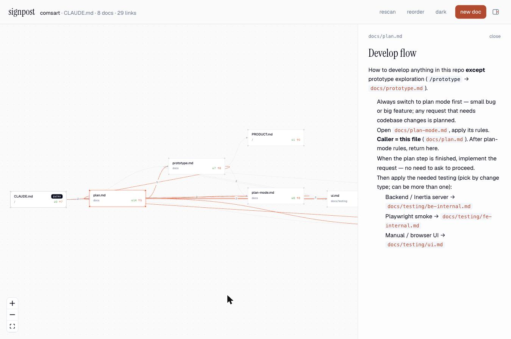

# Signpost

Visualize the context-pointer docs behind a `CLAUDE.md` / `AGENTS.md` file as a graph, and add new docs already wired into it.



Framework agnostic: it only reads markdown. Zero runtime dependencies; the UI ships prebuilt.

## Install

The repo is private and not on npm, so install from GitHub (the `prepare` script builds the UI on install):

```sh
pnpm add -D github:bipo38/signpost      # in the project whose docs you want to see
# package.json → "scripts": { "docs:graph": "signpost" }
pnpm docs:graph
```

One-off, without adding a dependency:

```sh
npx github:bipo38/signpost
```

Local clone linked into a sibling project:

```sh
git clone git@github.com:bipo38/signpost.git && cd signpost && pnpm install   # builds dist/
cd ../your-project && pnpm add -D link:../signpost
```

## Run

```sh
signpost                     # from a repo root; opens http://localhost:4747
signpost --root ../other --docs documentation --port 5000 --no-open
```

## Using it

- **Read.** Click a card to render the doc on the right. Backticked paths inside it are links to the other cards. Arrows go from the doc that references to the doc it references; a number on an edge is how many times.
- **Arrange.** Drag cards freely. **reorder** puts them back in the automatic left-to-right layout and refits the view. **rescan** re-reads the files after you edit them outside the tool.
- **Panel.** The icon at the far right of the header hides or shows the side panel; selecting a card or pressing **new doc** opens it again.
- **Theme.** **light** / **dark** follows your system by default and remembers your choice in the browser.

## What it reads

- Entry: `CLAUDE.md`, else `AGENTS.md`.
- Every `*.md` under `--docs` (default `docs/`), skipping `guide/` and `node_modules/`.
- Links: backticked paths (`` `docs/plan.md` ``) and markdown links (`[x](testing/ui.md)`), resolved from the repo root, then from the referencing file. Arrows point from the doc that references to the doc it references; a label is the reference count.

## Creating a doc

- **path** — where the file goes. Defaults to `docs/<uploaded name>` when you drop a file.
- **situation** — becomes a row in the entry file's first table (`| situation | \`path\` |`).
- **link from** — the entry file gets the table row; any other parent gets a `See also` line.
- **links to** — appended to the new doc as a `Related:` line.
- **return row** — offered for any doc with a `| Came from | Return to |` table.
- **body** — paste, drop a `.md`, or leave empty for a template naming the caller.

## Develop

```sh
pnpm install
pnpm dev:api    # API against ../olaaaaaaa/comsart on :4747
pnpm dev        # Vite UI on :5173, proxies /api
pnpm test       # node:test on server/graph.mjs
pnpm build      # dist/ served by the bin
```
